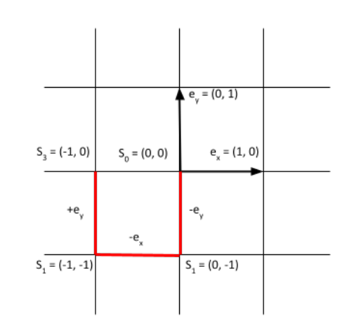
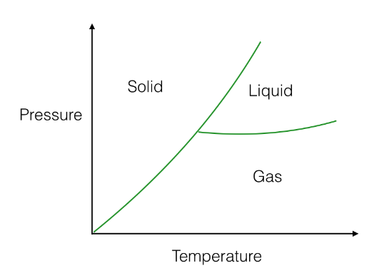

# Exercise 01: Random Walk

## 1-1). Polynomer Chains and Random Walks

<aside>
💡 Modelling sketch

- Coordinate system:
    - Cartesian coordinates

    

- Modelling object:
    - polymers

        

        - each segment has the same length
- Constraints on the model

    ⇒ for simplification

    i). At each grid point a segment can be represented

    

    ii). No interactions between the segments

    iii). Conformation of a polymer

    - X - a n-tuple

        

    - described by a tuple consisting the gitter points which are visited
    

    

</aside>

<aside>
💡 Algorithm:

- Random walk of length n in 2D
- math. representation

    

    - subscript represented the time step

        

    - uniform time steps in directions

    ⇒  4 directions possible ( ⬅️, ➡️, ⬆️, ⬇️)

    

- Goal: Observation of the behaviours of a short-chained polymer
    - Not possible to list out all conformations

        ⇒ exponential growth of the possibilities

- Ideas of the algorithm
    - using short chain instead of a long chain
    - accidentally generated “Ensemble” as the typical example
</aside>

# Exercise 1.2: Monte-Carlo

# Theory

- Course Content

[Ex01.pdf (ethz.ch)](https://ethz.ch/content/dam/ethz/special-interest/chab/physical-chemistry/computational-chemistry-dam/documents/exercises_StatPhys/Ex01.pdf)

[week01b_biology_statistics.pdf (ethz.ch)](https://ethz.ch/content/dam/ethz/special-interest/chab/physical-chemistry/computational-chemistry-dam/documents/lecture-notes_StatPhys/week01b_biology_statistics.pdf)

- Resources
    - [3.2 Monte Carlo methods (ornl.gov)](https://web.ornl.gov/~kentpr/thesis/pkthnode19.html)
    - [The Metropolis algorithm (northeastern.edu)](https://web.northeastern.edu/afeiguin/phys5870/phys5870/node80.html)
    - [A Random Walk & Monte Carlo Simulation || Python Tutorial || Learn Python Programming - YouTube](https://www.youtube.com/watch?v=BfS2H1y6tzQ)

## Exercise 1-2: Monte Carlo

---

### Algorithmic Aspect

**Recap: What does Monte-Carlo mean?**

> Monte-Carlo:  a broad class of computational algorithms that rely on repeated random sampling to obtain numerical results.
>

**Markov Chain**

- main components

    i). State Space

    ii). Probability Transition Function

**Random walk & Monte-Carlo**

<aside>
💡 **Markov Chain Monte-Carlo (MCMC)**

> MCMC:   methods comprise a class of algorithms for sampling from a probability distribution
>
- **Given:**  state space which is unknown or very large
- **Constraint:**  the constructed Markov chain shall have the desired distribution as its equilibrium distribution
- **Way of sampling:**   random walk
    - with increasing number of steps involved ⇒ more closely to the actual desired distribution
    - eg. the step increased can be randomly chosen from a uniform distribution
- **Visualization of the sample:**
    - realized by recording states from the chain
    - eg. in a matrix recording points visited
</aside>

**Application:  Metropolis Algorithm for understanding phase diagram**

**Modelling:**

- Follows the Boltzman distribution

example of a Markov chain and moving from the starting point to a high probability region ⇒ example for sampling from a probability distribution

- think of molecules as hard discs (with no overlapping) bouncing around in a box
- assign for each molecule coordinate (x, y)

    ⇒ total dimension of the space $\R^{2N}$

<aside>
💡 **Algorithm:**

*Metropolis algorithm: For iterations $i = 1,..., n$  do:*

*1. Consider a molecule and a box around the molecule.*

*2. Uniformly draw a point in the box.*

*3. According to a “rule", you accept or reject the point.*

*4. If it’s accepted, you move the molecule.*

</aside>

### Physical Aspect

---

**Boltzmann distribution**

> Probability of a certain state of a system can be represented by the state’s energy and temperature of the system to which the distribution is applied
>

Q - the normalization denominator

- constraint: the probabilities of all accessible states must add up to 1
- it is the distribution that maximizes the entropy

**Müller-Brown Potential**

- [3D Visualizer](https://demonstrations.wolfram.com/TrajectoriesOnTheMullerBrownPotentialEnergySurface/)
- [some funny intuition](https://www.youtube.com/watch?v=BsEVmInG3Oo)
- function contains...

    i).   2 local minimum

    ii).  1 absolute minimum

- Def. Minimum energy path (MEP)

    > The lowest energy path from reactant to product. The mostly likely reaction mechanism that occurs.
    >

    

    

    

    the blue curve showing the energy corresponding to different conformations has the meaning that it is the minimum energy path on a more complicated surface

- Saddle point

    

    saddle point being maximum in one direction and a minimum in all other directions ⇒ common techniques is the maximization of one degree of freedom and minimization in other degrees of freedom

    > **Why finding the saddle point?**
    >
    > - barrier, transition state
    > - By firstly finding the saddle point and then follow the gradient of the energy downhill both forward and backward
    >     
    >     ⇒ we can map out the MEP
    >     
    >     ⇒ we can thus establish what initial and final state the saddle point corresponds to
    >     
    >
    > **Assumption:**  *a Boltzmann population is reached for the intermediate stable configurations...*
    >
    > ⇒ the overall rate is determined by the highest energy saddle point
    >
    > *[[ Source ]](https://www.researchgate.net/post/How-to-find-minimum-energy-path-for-reaction)*
    >

### Application

---

<aside>
💡 Modelling sketch

- Coordinate system:
    - Cartesian coordinates $\Z^2$
- Modelling object:
    - Study of quantities of a system with temperature $T$ in thermodynamic equilibrium
        - General formula for the Ensemble average
            - $A$ - some physical quantity
            - $p(i)$ - Boltzmann weight

        $$
        \braket{A} = \sum_{i}p(i) A(i)
        $$

- Constraints/Important properties of the model

    ⇒ for simplification

    i). Boltzmann distribution

    

    for different substance it may be a bit different

    **Statement: a thermodynamic system in equilibrium follows the Boltzmann distribution**

    $$
    p(i)=\frac{e^{-\beta E(i)}}{Z}
    $$

    - $i$  - state of the system
    - $E(i)$ - energy of the system in state $i$
    - $\beta = \frac{1}{k_B T}$
        - $k_b$ - Boltzmann constant
        - $T$ - temperature in Kelvin
    - $Z$ - sum of the states
        - $Z=\sum_i e^{-\beta E(i)}$
        - **Problem: not quite possible to explicitly calculate $Z$**

</aside>

<aside>
💡 Algorithm:

- Metropolis-Monte-Carlo Algorithm
- algo. representation

    

    line 4:  choosing between 1 and another term because probability cannot be bigger than 1

Goal: Observation for the research for the possible states of a system

- As example we study the quantity “‘Müller-Brown Potential”

    ⇒ we apply the algorithm on a energy surface described by this potential function

- **Problem: not quite possible to explicitly calculate $Z$**

Ideas of the algorithm

- do not calculate the sum of the states $Z$ in the Boltzmann distribution explicitly
- accidentally generated “Ensemble” as the typical example
</aside>

**NOTE:**

- In the current implementation the unit of the potential used is [kJ/mol]

    ⇒ the Boltzmann constant is accordingly adjusted for that

- The temperature...

***CASE 1: T → 0 K***

_0K.png)

For T = 0K ⇒ looks like random walk in task 1, low penalty so we just freely wander around

_0.02K.png)

T = 0.02 K ⇒ some clustering can be seen

***CASE 2: T → infinity***

_inftyK.png)

Very high temperature brings high penalty, no “wandering around”

***Comparing to the normal case below with T = 300 K***

_300K_b.png)

with 300K temperature, the walk seems like someone is “wandering around”

**g) (Bonus) - implement the (Stochastic-) Gradient-Descent ((S) GD) algorithm**

Goal: Find the absolute minimum of the ‘Müller-Brown Potential” at $(-0.558, \,\, 1.442)$

- implement the SGD algorithm which is combined with the Monte Carlo method
- Def. SGD algorithm

    > Idea:  optimizing the initial value $X$ by following the negative gradient $-\nabla_X f$ of the function $f$
    >
- Constraints:
    - find the result independent of the initial position
    - no information about the gradient of the absolute minimum is known
        - The negative gradient $-\nabla_Xf$ is often unknown

        ***⇒** 💡 **Monte Carlo method can help in this situation***
