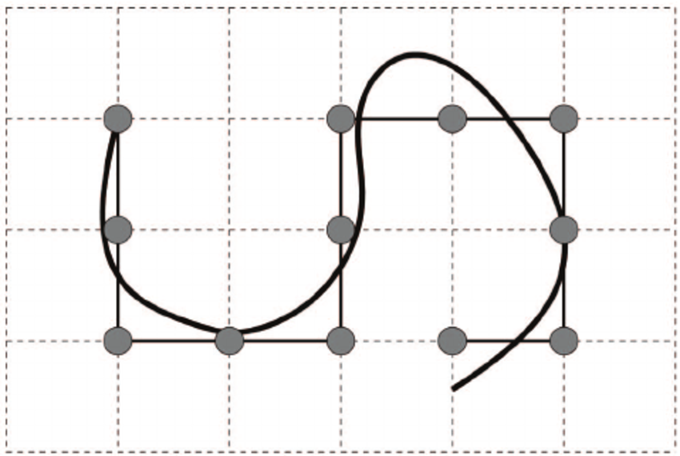
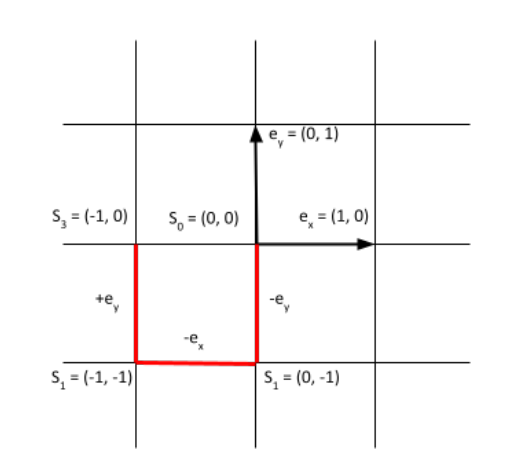

# Exercise 1.1: Polynomer Chains and Random Walks

# Exercise 1-1

<aside>
💡 Modelling sketch

- Coordinate system:
    - Cartesian coordinates

    

- Modelling object:
    - polymers

        

        - each segment has the same length
- Constraints on the model

    ⇒ for simplification

    i). At each grid point a segment can be represented

    

    ii). No interactions between the segments

    iii). Conformation of a polymer

    - X - a n-tuple

        

    - described by a tuple consisting the gitter points which are visited

    

    

</aside>

<aside>
💡 Algorithm:

- Random walk of length n in 2D
- math. representation

    

    - subscript represented the time step

        

    - uniform time steps in directions

    ⇒  4 directions possible ( ⬅️, ➡️, ⬆️, ⬇️)

    

- Goal: Observation of the behaviours of a short-chained polymer
    - Not possible to list out all conformations

        ⇒ exponential growth of the possibilities

- Ideas of the algorithm
    - using short chain instead of a long chain
    - accidentally generated “Ensemble” as the typical example
</aside>
